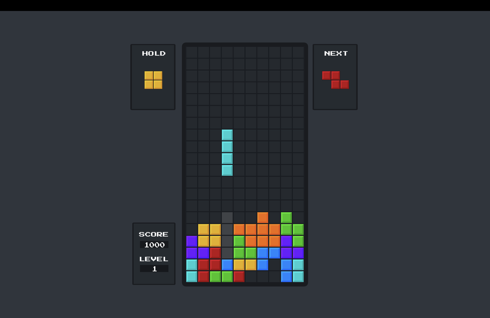

# Tetris-clone

A Tetris clone created in Unity. This is just a little project I created to try making something in Unity.

## Features
- 7-bag randomization
- Hold piece
- Next piece preview
- Ghost piece
- Controller support
- Top 3 high score tracking
- Pause menu with volume controls

## Download
Grab the latest build for Windows or Mac from the [Releases](https://github.com/Axalon01/Tetris-clone/releases) page.

## Credits
**Music**
- Tetris Song — [Musical Light](https://www.youtube.com/watch?v=ytLB6RY5J6Q)

**Sound Effects**
- Lock SFX — [acclivity](https://freesound.org/people/acclivity/sounds/25880/)
- Line Clear SFX — [Mixkit](https://mixkit.co/free-sound-effects/coin/)

**Sprites**
- [zigurous](https://github.com/zigurous/unity-tetris-tutorial/tree/main/Assets/Sprites)
